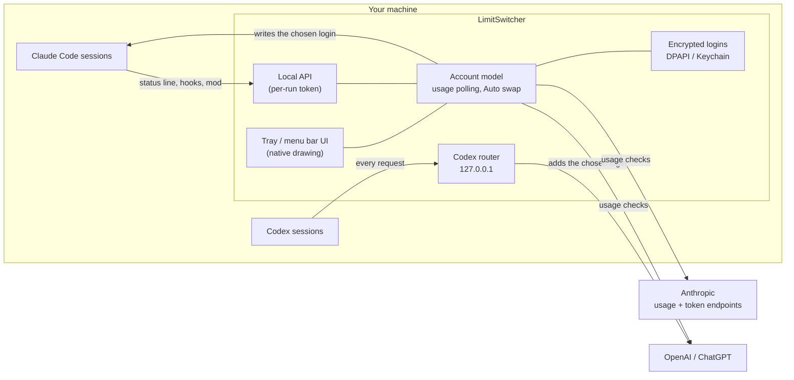

# How it works

What LimitSwitcher changes on your machine, how it switches accounts, and how it talks to Anthropic and OpenAI. Everything it changes in Claude Code's and Codex's settings is put back when it quits.

- [Architecture](#architecture)
- [Switching accounts](#switching-accounts)
- [Separate accounts per window](#separate-accounts-per-window)
- [What the app changes in Codex's config](#what-the-app-changes-in-codexs-config)
- [The Auto resume hook](#the-auto-resume-hook)
- [Staying clear of rate limits](#staying-clear-of-rate-limits)
- [Claude Code status line](#claude-code-status-line)
- [Storage and privacy](#storage-and-privacy)

## Architecture

- **One Python process** holds the account model (`live.py`, `core.py`), the usage clients (`providers.py`, with long-lived HTTPS connections in `connections.py`), the Codex router (`codex_proxy.py`) and a small local API (`web.py`) that Claude Code's status line, hooks and the optional mod talk to.
- **The UI is native.** On Windows the panel, menus, taskbar view and full view are layered Win32 windows drawn with Pillow (`flyout_render.py`, `fullview_render.py`). On macOS the menu bar panel is a WebKit popover and the full view is drawn with Core Graphics in a second process that only exists while it's open.
- **Integrations are set up while the app runs and undone on quit** (`integrations.py`): the Codex config lines, the Claude Code hook and the status line.

## Switching accounts

- *Claude Code:* the app saves the outgoing account's newest tokens and writes the chosen login into `~/.claude/.credentials.json` + `~/.claude.json` (on macOS, the "Claude Code-credentials" Keychain item). A running Claude Code notices and uses it on its next request. Switches hold Claude Code's own login locks, so a renewal Claude Code has in progress finishes first and its fresh single-use refresh token isn't lost.
- *Codex:* the chosen login is written into `~/.codex/auth.json` (so new windows and Codex's `/status` show it), and while the app runs, Codex sends its requests through the app (a local router on `127.0.0.1`), which adds the chosen account's login. So a switch also applies to sessions that are already open, on their next request.
- *On quit:* the app puts `~/.codex/config.toml` back exactly as it was, so Codex works without the app, on the chosen account.

## Separate accounts per window

Every window is an ordinary Claude Code window on `~/.claude` (its settings, plugins, sessions and its own login). What differs is where its requests go: `ANTHROPIC_BASE_URL` points at a small router in the app (`127.0.0.1`, with a random secret and the window's id in the path), which puts the window's account's login on each request and passes everything else on to Anthropic unchanged, answers streamed straight back. A window on the main account sends Claude Code's own login through untouched.

- **Getting a window there:** `/swapaccount` (the mod) sets those two variables in the running window, for its next request on; Claude Code reads them again for each one. With the setting on, a small `claude` wrapper goes first on your PATH (Windows: your user PATH, for terminals opened from then on; elsewhere, add the folder the app names) and starts each new interactive window with them. No process of the wrapper's stays (on Windows its Python only writes the two variables for `claude.cmd`). A window that already had its own `ANTHROPIC_BASE_URL` (a gateway) keeps it: the router forwards there.
- **Logins:** the main login is Claude Code's, which renews it as usual; the router only reads it. Any other account's login is renewed by the app shortly before it expires (or once when Anthropic refuses it), since no Claude Code holds it. If it can't be used (signed out), the window's messages go with its own login until you sign that account in again, and the app says so once.
- **Cheap:** one thread per open connection (an idle one closes after two minutes), nothing kept but each window's account (`windows.json` in the data folder, so windows keep their account across an app restart), connections to Anthropic kept open and reused. A long streamed answer costs the router a few milliseconds of CPU.
- **Before 1.4** a window had a config folder of its own (`profiles/` in the data folder) with links into `~/.claude`, which Claude Code's own saves could break (on Windows its settings, and so its plugins, then drifted apart). The app takes each such folder's newest login back and deletes the folder once its window has closed.

From a terminal: `python -m account_switcher.profiles list` (each account and where it's in use).

## What the app changes in Codex's config

While it runs, every line it adds to `~/.codex/config.toml` is tagged `# account-switcher` and removed again on quit:

- `openai_base_url` points at the router;
- `enable_request_compression = false`, so the router can read requests;
- `daemon_auto_start = false`. Codex's shared background server opens a console window for every command on Windows ([openai/codex#44768](https://github.com/openai/codex/issues/44768), [#48074](https://github.com/openai/codex/issues/48074)). Sessions also attach to it whenever it's running, and it keeps the settings it started with, so its sessions would bypass the router. The app stops a running one as soon as no session has been active for 90 seconds; after that, each Codex session runs in its own terminal, goes through the router, and nothing flashes.

**Start with Windows** is on by default, since Codex's requests go through the app. Switch it off in the full view's Settings (**Launch with Windows**).

## The Auto resume hook

- The app adds a `StopFailure` hook to `~/.claude/settings.json` while it runs, whatever the toggles say, and leaves it there when you quit the app (Claude Code reads hooks when a session starts, so a hook added later would miss sessions already open, including ones opened while the app was closed). With the app closed the hook does nothing. Installing, updating and uninstalling take it out (an update's new copy puts it back); the app answers "do nothing" while Auto swap and Auto resume are both off. Only its own entry is added.
- While Auto resume is on, it also turns Claude Code's own wait (`autoContinueAtUsageLimit`) **on**. With it off, a usage limit opens a "What do you want to do?" dialog that holds the session until you answer it, and the app's continue waits behind it. With it on there is only a one-line wait, which Claude Code cancels by itself when the account is switched or a new turn starts. The hook also skips its continue if the session has already gone on by itself while it waited. Your own setting is put back when Auto resume is off or the app quits.

## Staying clear of rate limits

- Claude: every account is checked every minute, and the account in use only every 30 minutes while Claude Code's status line already reports it live. Requests identify as Claude Code, because Claude's usage endpoint throttles other clients hard.
- Codex: the account in use every 90 seconds (45 near a limit), others every 5 minutes or just after a reset.
- Passed reset times are applied locally without a request.
- Requests are spaced out.
- Opening the panel only refetches data older than 2 minutes, and Refresh works at most every 30 seconds.
- A 429 backs off exponentially, from 5 minutes up to an hour.

## Claude Code status line

LimitSwitcher shows itself in Claude Code's status line (the line under the prompt) once the [Claude Code Status mod](claude-code-mod.md) is installed (Settings → **Claude Code Status mod**).

- **Why it's there:** Claude Code hands the status line the live 5-hour and weekly usage of the account in use. That's how LimitSwitcher follows Claude usage live, after every reply, without asking Claude's usage API.
- **With the mod installed, without a status line of your own:** it shows `⇄ LimitSwitcher`, the account in use, the session's model and effort (`Opus 5.5 (high)`), what's left of its limits, and the session's context (`ctx 183k/82% left`: tokens in use and what's left of Claude Code's context window; the numbers go green, yellow and red as it fills). While Jev compacts the icon is yellow and says so; for 45 seconds after, the line says what it saved (`Jev saved ~120k`), and ctx shows the size less what Jev saved until the next reply. With your own status line, the context is already in the input Claude Code gives it.
- **With your own status line:** LimitSwitcher runs yours for you, so the usage still comes in, and yours stays exactly as it was. With the mod installed, a dim `⇄ LimitSwitcher` follows it, so you can see the app is on.
- **Without the mod, and without one of your own:** Claude Code's status line is left alone, and the account in use is checked through the usage API instead (every minute).
- **Every session stays current:** Claude Code only knows the usage from a session's own last reply, so an idle session would keep old numbers. LimitSwitcher has Claude Code refresh the status line every 5 seconds (unless you set your own `refreshInterval`; a run is a small process start of about 15 ms, well under 1% of a core per open session), so a compaction shows up within a few seconds. It gives your own status line command its freshest numbers for the account.
- **On quit** your original status line setting is put back.

## Storage and privacy

- **Saved logins are encrypted:** with Windows DPAPI (tied to your Windows user) under `%LOCALAPPDATA%\LimitSwitcher`, and on macOS with a random key kept in your login Keychain, under `~/Library/Application Support/LimitSwitcher`.
- **Nothing is sent anywhere** except the providers' own usage and token endpoints (and, only if you turn on Jev compaction, the masked tool outputs it judges to OpenRouter).
- **The local API** listens on 127.0.0.1 only and needs a per-run token.
- **Updating, reinstalling or uninstalling keeps your data.** The data folder was called `AccountSwitcher` before the app was renamed; an old folder is moved over by itself.
